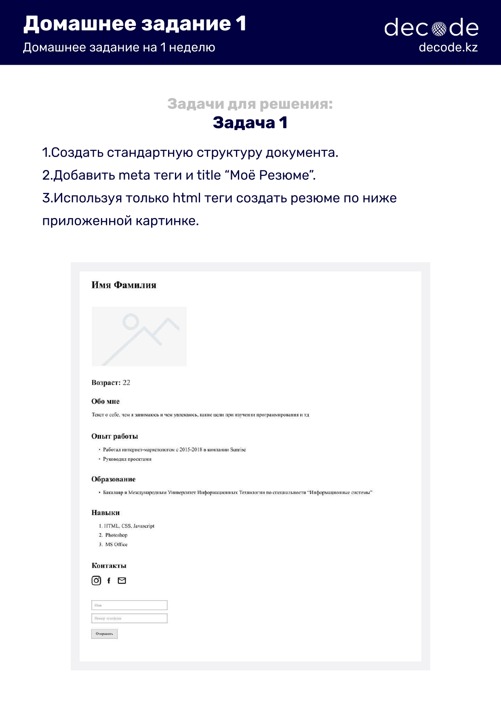
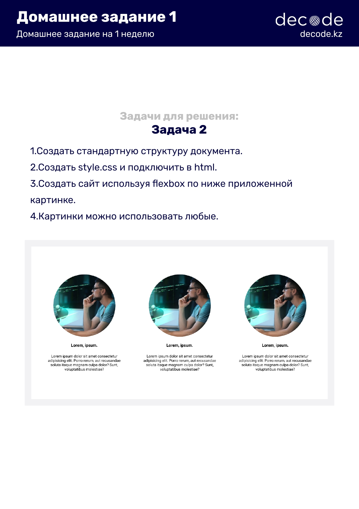
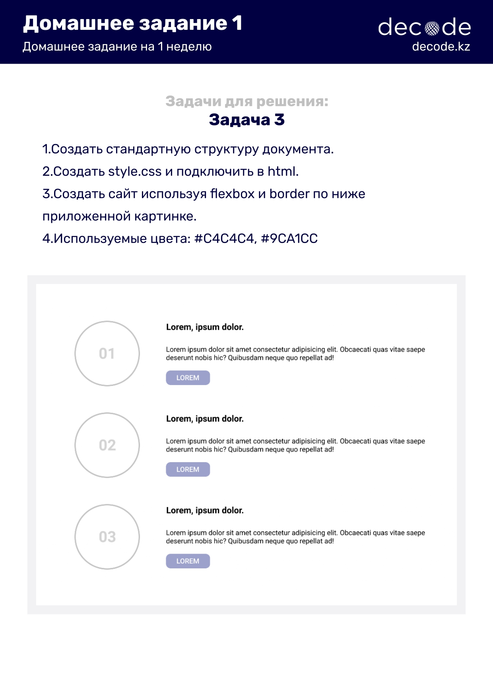
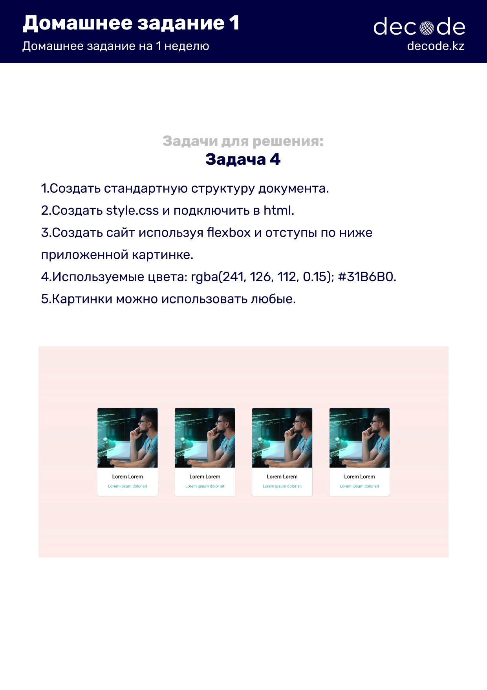
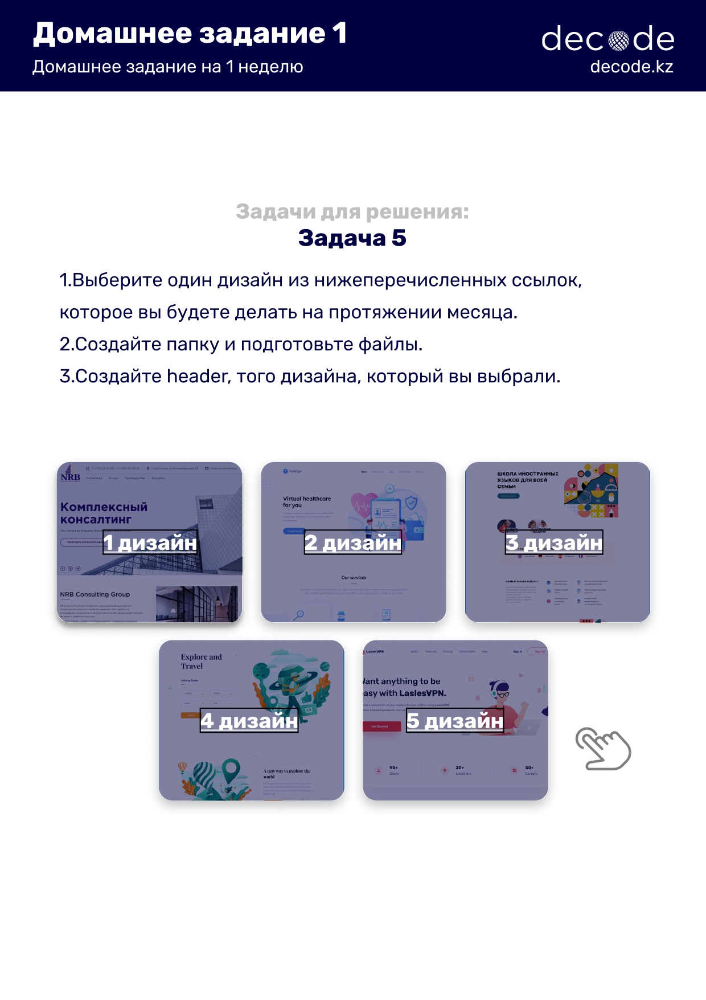

[](https://classroom.github.com/online_ide?assignment_repo_id=7565404&assignment_repo_type=AssignmentRepo)
# Знакомство с HTML, CSS

 

 

### HTML (HyperText Markup Language) 
 - Язык разметки гипертекста, используемый для создания документов в сети интернет.
 - Для создания документа нам надо создать простой текстовый файл, а в качестве расширения файла указать *.html
 - HTML5 - Это пятая версия HTML
### Документ HTML5, как и любой документ HTML, состоит из элементов, а элементы состоят из тегов. 
 - Элементы имеют открывающий и закрывающий тег. Например: 
```
<p>Текст элемента paragraph</p>
```
 - Элементы могут состоять из одиночных тегов
```
<br/>
<input type="button" value="OK" />
```
 - или парных тегов
```
<div></div>
```
### Каждый элемент может иметь атрибуты внутри открывающего тега. 
 - Атрибуты предоставляют дополнительную информацию об элементах.
 - Общие, глобальные атрибуты для всех элементов, как например id, style, class
```
<div id="123" style="color:red" class="" ></div>
``` 
 - Специфические атрибуты, применяемые к определенным элементам, как например type
```
<input type="text" />
```
 - Булевые, логичные атрибуты. Не имеют значения. Например, у кнопки можно задать атрибут disabled
```
<input type="button" disabled />
```
- Одинарные или двойные кавычки, при определении атрибутов. 
```
<input type="button" value='Кнопка "Привет мир"'>
```

### Блочные элементы - являются основой, которая используется для верстки веб-страниц.
- Такой элемент представляет собой прямоугольник, который по умолчанию занимает всю доступную ширину страницы
- длина элемента зависит от его содержимого
- всегда начинается с новой строки, то есть, располагается под предыдущим элементом
```
<p>Paragraph</p>
<h1>Header text 1</h1>
<h2>Header text 2</h2>
<h3>Header text 3</h3>
<h4>Header text 4</h4>
<h5>Header text 5</h5>
<h6>Header text 6</h6>
<ul>
  <li>Html</li>
  <li>Css</li>
  <li>JavaScript</li>
</ul>
<ol>
  <li>Html</li>
  <li>Css</li>
  <li>JavaScript</li>
</ol>
<div></div>
```
### Cтрочный элемент 
- не переносится на новую строку, а располагается на той же строке, что и предыдущий элемент
- находятся внутри блочных элементов и их ширина зависит лишь от содержимого
- в нем может находиться только контент и другие строчные элементы
- блочные элементы в строчные вкладывать нельзя
```
<a href='https://decode.kz/'>это ссылка на Decode.kz</a>

<input type=text>
<input type=password>
<input type=submit>
<input type=radio>
<input type=checkbox>
<span></span>
```
### CSS - это язык для описания стилей 
 - CSS позволяет контролировать: цвет, шрифты, позиционирование, интервалы, размеры, декорации, и переходы элементов
### Методы подключения CSS
 - Inline (Встроенный стиль) - служит для изменения одиночного тега на веб-странице. Для подключения стиля используется атрибут style.
```
<h1 style="font-size: 50px; color:red;">Decode School</h1>
```
 - Internal (Внутренняя таблица стилей) - может использоваться, если одна отдельная HTML страница имеет свой уникальный стиль и этот стиль больше нигде не используется на других страницах. 
```
<style>
h1 {
  font-size: 50px;
  color: red;
}
</style>
```
 - External (Внешняя таблица стилей ) -
используются для подключения
одновременно ко многим страницам сайта.
Обычно это отдельный CSS файл. Каждая
HTML страница должна содержать ссылку
на файл внешней таблицы стилей внутри
элемента <link>.
```
<link rel="stylesheet" href="index.css" />
```
 - index.css
```
h1{
 font-size: 50px;
 color: red;
}
```
### CSS селекторы
- CSS селектор элемента - Селектор элементов выбирает HTML элементы на основе имени элемента. Здесь все элементы <p> на странице будут применять шрифт 50px, и синий свет.
```
 p{
  font-size: 50px;
  color: blue;
 }
``` 
```
 <p>Decode school</p>
```
 - CSS селектор class. Классы - это
многоразовые стили, которые можно
добавлять к любым элементам HTML.
Здесь элемент, который имеет название
class=" p-text" будут применять шрифт
50px, и синий свет. Внутри элемента стиля
CSS имена классов начинается с точки.
```
.p-txt{
  font-size: 50px;
  color: blue;
}
```
```
<p class='p-txt'>Decode school</p>
```
 - CSS селектор id. Атрибутов id можно
использовать идентификатор для
стилизации одного элемента. Атрибуты
id должны быть уникальными. Поэтому
не присваивайте более одного элемента
одному и тому же атрибуту id. Внутри
элемента стиля CSS имена id
начинается с #.
```
#p-txt{
 font-size: 50px;
  color: blue;
}
```
```
<p id='p-txt'>Decode school</p>
```

### CSS цвета
 - Hexadecimal
(#ffffff ) - 6 шестнадцатеричных цифр
 - Встроенные
(White, black)
 - rgb  (Red, Green, Blue)
(255,255,255)
 - rgba, rgb с каналом alpha (RGBA) 
(255,255,255,0.5)

### Font
 - font-size размер шрифта
 - font-style стиль шрифта
 - font-weight жирность шрифта
 - font-family  семейство шрифтов
 
 ### Свойства текста
 - text-decoration преобразование текста uppercase, lowercase, capitalize
 - text-align выравнивание текста center, left, right
 - text-decoration оформление текста underline, overline, line-through, none
 - line-height межстрочный интервал
 - white-space перенос строк
 - word-spacing промежутки между словами
 - letter-spacing межбувенный интервал

### background
 - background-color цвет фона
 - background-image картина на задний фон
 - background-repeat повторение фона repeat, no-repeat
 - background-size размер фона cover, contain
 - background-position расположение фона top center right, left, bottom
 - background-attachment фиксация фона fixed, scroll

### display - отображение элементов
- атрибут, свойство display отвечает за вывод и визуальное отображение элементов на странице
```
.container {
  display: flex;
}
```
```
<div class="container">
    <div  style="background-color:red; width:20px;">1</div>
    <div style="background-color:green; width:20px;">2</div>
    <div style="background-color:blue;  width:20px;">3</div>
    <div style="background-color:yellow;  width:20px;">4</div>
</div>
```
### flex-direction - указывает направление элементов
 - row (значение по умолчанию) : слева направо;
 - row-reverse: справа налево;
 - column: сверху вниз;
 - column-reverse: снизу вверх;

### justify-content - выравнивает вдоль главной оси (горизонтально)
 - flex-start (значение по умолчанию) : блоки прижаты к началу главной оси
 - flex-end блоки прижаты к концу главной оси
 - center блоки располагаются в центре главной оси
 - space-between первый блок располагается в начале главной оси, последний блок – в конце, все остальные блоки равномерно распределены в оставшемся пространстве.
 - space-around все блоки равномерно распределены вдоль главной оси, разделяя все свободное пространство поровну.
 
### align-items - выравнивает по перпендикулярной оси (вертикально)
  - flex-start — элементы выравниваются от
начала перпендикулярной оси;
 - flex-end — элементы выравниваются от конца
перпендикулярной оси;
 - center— элементы выравниваются по центру;
 - stretch— элементы растягиваются, занимая
все пространство по перпендикулярной оси
(значение по умолчанию).
 - baseline — элементы выравниваются по
базовой линии;

### flex-wrap - перенос блоков на новую строку
 - nowrap — блоки не переносятся (значение по умолчанию);
 - wrap — блоки переносятся;
 - wrap-reverse— блоки переносятся и располагаются в обратном порядке.

### padding - устанавливает внутренние отступы
-  это пространство между содержанием элемента и его
границей

### margin - внешний отступ
- это расстояние от одного блока до
другого, межблоковое пространство.

### border - это свойство, с помощью которого можно задать
границы, рамки для элемента
 - Border-width: ширина границы (2px)
 - Border-color: цвет границы (red)
 - Border-style: стиль границы (solid, dotted, ...)
 - Border-radius: округление (5px)

### псевдоклассы - определённое состояние элемента
 - :hover
 срабатывает, когда
пользователь наводит на элемент
мышью
```
button:hover {background-color: tomato;}
```

 - :focus применяется к элементу при получении им фокуса.
Например, для текстового поля формы получение фокуса
означает, что курсор установлен в поле, и с помощью
клавиатуры можно вводить в него текст
input:focus{}

 - :first-child
позволяет задать стиль для первого дочернего
элемента из группы элементов, то есть таких, у которых один
родитель. Внутри <div> элемента, есть дочерние <p> элементы.
div p:first-child {} . Он применяет стиль для первого дочернего
элемента

 - :last-child
позволяет задать стиль для последнего дочернего
элемента из группы элементов, то есть таких, у которых один
родитель. Внутри <div> элемента, есть дочерние <p> элементы.
div p:last-child {} . Он применяет стиль для последнего
дочернего элемента

 - :nth-child позволяет вычислить конкретный дочерний
целевой элемент. first-child, он применяет стиль только
для первого элемента, а last-child для последнего
элемента, а nth-child для остальных элементов или же
можем выбрать только четные элементы, или только
нечетные элементы должны применить стиль
div p:nth-child()
```
div p:nth-child(2), div p:nth-child(odd), div p:nth-child(even)
```

 - :not позволяет выбрать и стилизовать только те
элементы, которые не содержат селектор, указанный в
скобках
div p:not(:nth-child(2)){} -> применяет стиль ко всем <p>
элементам, кроме второго элемента.
```
div p:not(:nth-child(2))
```

### Псевдоэлементы - селекторы, которые определяет область элементов
 - ::first-letter определяет стиль первого символа в тексте
элемента, к которому добавляется. К этому псевдоэлементу
могут применяться только стилевые свойства, связанные со
свойствами шрифта, полями, отступами, границами, цветом
и фоном.
div p::first-letter{}


 - ::first-line задаёт стиль первой строки форматированного
текста. Если <p> элемент занимает несколько строк,
используя псевдоэлемент ::first-line можем добавить
стиль только к первой строке
p::first-line{}

 - ::before применяется для отображения контента до
содержимого элемента, к которому он добавляется.
Работает совместно со свойством content.
```
div p::before{
 content: '"';
 color: tomato;
}
```

 - ::after используется для вывода контента после
содержимого элемента, к которому он добавляется.
Работает совместно со свойством content.
```
div p::after{
 content: '"';
 color: tomato;
}
```

### Работа с позиционированием и отступами
 - Позиционирование в CSS — это свойство, с помощью которых можно перемещать
элементы со своего обычного места и определять их положение относительно других объектов. 
 - элементы могут накладываться
друг на друга, словно слои, и порядком этих слоев также можно управлять.

### типы позиционирования
 - Relative (Относительно позиционируемый
элемент)
 - Absolute (Абсолютно позиционируемый элемент )
 - Sticky (Элемент с липкой позицией)
 - Fixed (Фиксированное позицииионирование)

### Relative
 - элемент может перемещаться относительно
его текущей позиции.
 - свойствами top, right, bottom и left можно
двигать элемент в нужном направлении.
```
.relative{
 position: relative;
 top:20px;
 left:60px;
}
```
### Absolute
 - элемент исчезает с того место, где он должен быть, и позиционируется заново
 - координаты отчитываются от родителя
```
.absolute {
 position: absolute;
 top: 0;
 right: 0;
 background-color: yellow;
}
```

### Fixed
 - элемент находится в видимой области и не двигается во время прокрутки страницы
 - фиксируется на экране
 ```
 .fixed{
  position: fixed;
  width:100%;
  top:0;
  left:0;
  background-color: yellow;
 }
 ```
### Sticky
 - элемент позиционируется до тех пор пока не пересекает определенный порог,
 после чего становится фиксированным в рамках ближайшего родителя
 ```
 .sticky{
  position: sticky;
  width:100%;
  height: 100px;
  background-color: red;
  top:10;  
 }
 ```









https://www.figma.com/file/aISiV1QgWxw5yS7boXWs0u/1.-NRB-Consulting-Group?node-id=0%3A1
https://www.figma.com/file/00w9bjKGNICfsH1hL2WmwG/2.-Trafalgar?node-id=0%3A1
https://www.figma.com/file/NEkSq3cyksSRsSWH8RXKIa/3.-LaslesVPN?node-id=0%3A1
https://www.figma.com/file/wkRaAQRMmvXVd7n7h7RV1Y/4.-SpeakySchool?node-id=1%3A6
https://www.figma.com/file/lX0c14ZT7ZDMA0k6KTl8Lo/5.--Thousand-Sunny?node-id=1%3A2
